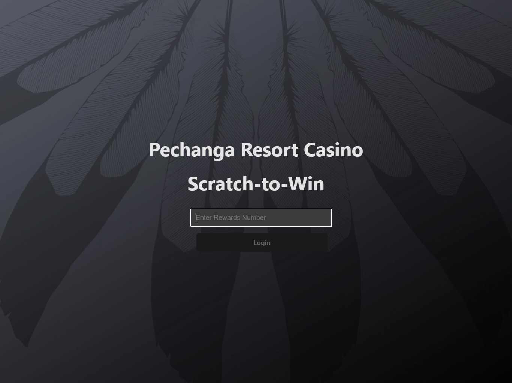
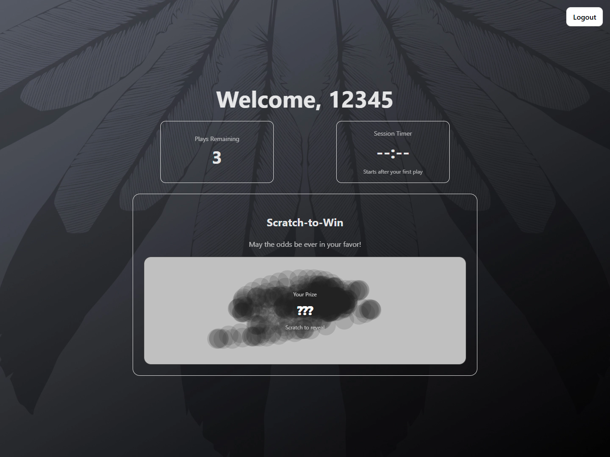

# Scratch-to-Win Kiosk Game

A full-stack kiosk game built with .NET 8, EF Core, SQLite, and React, featuring session-based gameplay, weighted prize logic, and persistent play history.

## Screenshots

  
  
  
<em>Left: Login Screen • Right: Scratch Gameplay</em>

## Architecture

Frontend (React + Vite)
 
↓
 
REST API (.NET 8)
 
↓
 
EF Core
 
↓
 
SQLite database

## Game Rules

- Players receive 3 daily plays
- First play starts a 5-minute session window
- Remaining plays must be used within the window
- Expired sessions forfeit remaining plays
- Weighted prize odds determine outcome
- Play history persisted in database
- Tracks if user has ever won "Gift Item"

## Tech Stack

Backend:
- .NET 8 Web API
- EF Core
- SQLite
- Repository Pattern
- Dependency Injection

Frontend:
- React
- Vite
- Canvas API (custom scratch implementation)
- Idle detection system

## Running the Project

### Prerequisites
- .NET 8+ - https://aka.ms/dotnet/download
- Node 18+ (LTS) - https://nodejs.org/en

### Backend
cd KioskGame.Api
 
dotnet build
 
dotnet run

### Frontend
cd kiosk-frontend
 
npm install
 
npm run dev

## Future Improvements

- Real scratch texture image overlay
- One-Time Gift Item Rule
- Admin dashboard for prize configuration
- Unit Tests
- Player authentication
- Additional Views (Attract Screen, Session Expired Screen)
- Cloud database deployment
- Containerization with Docker
